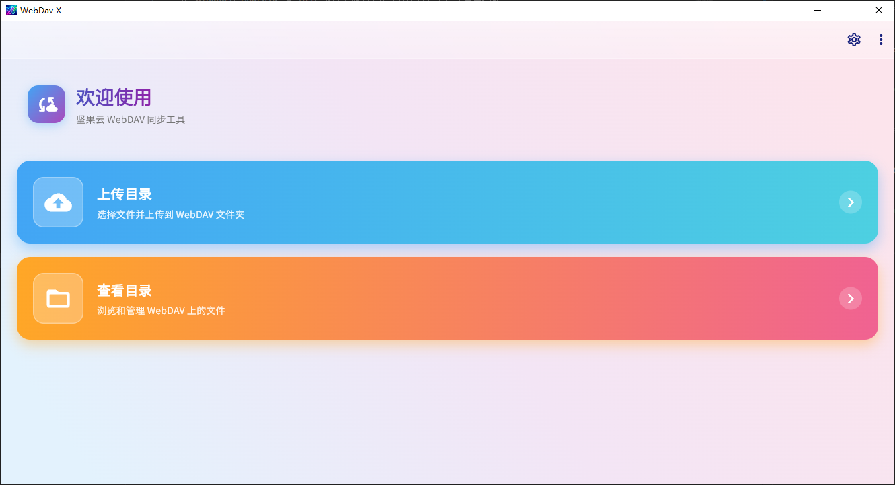
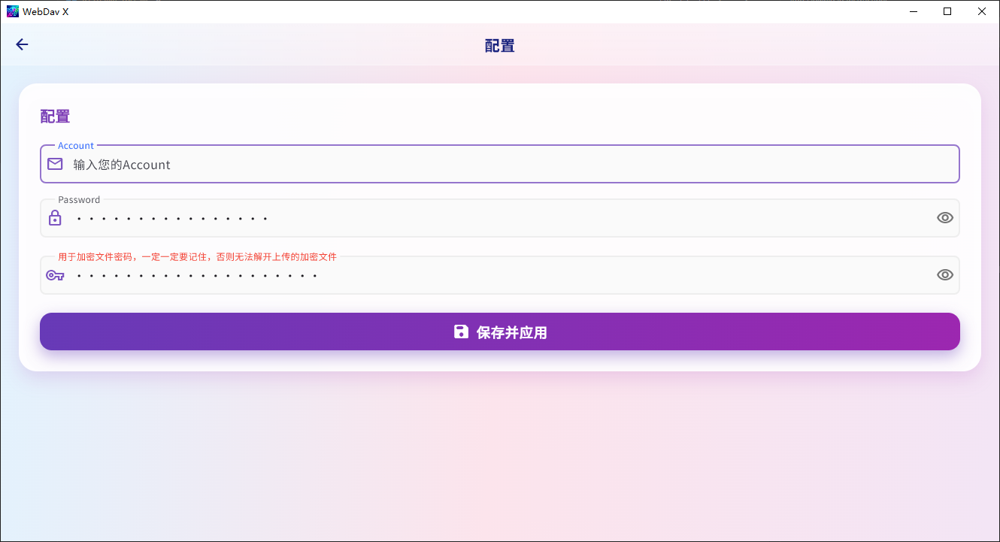
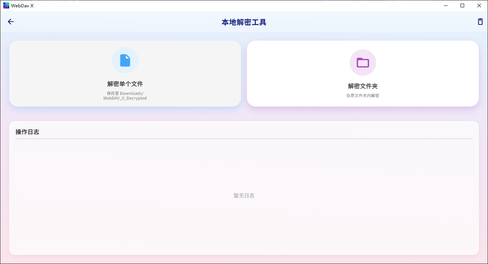
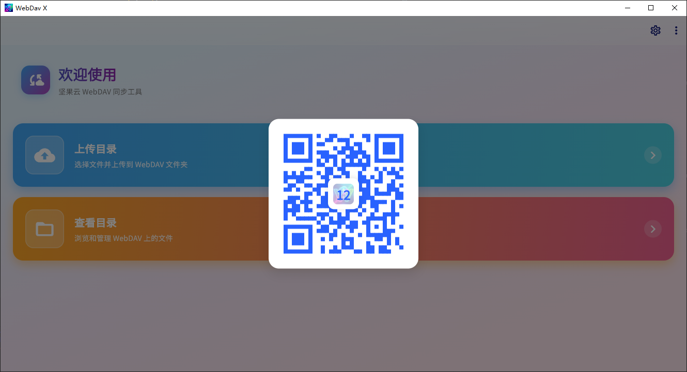
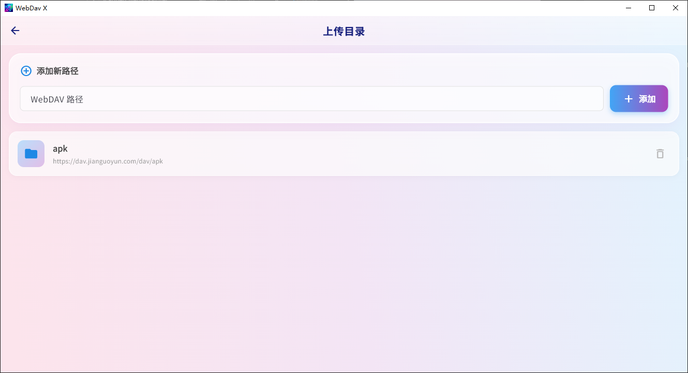
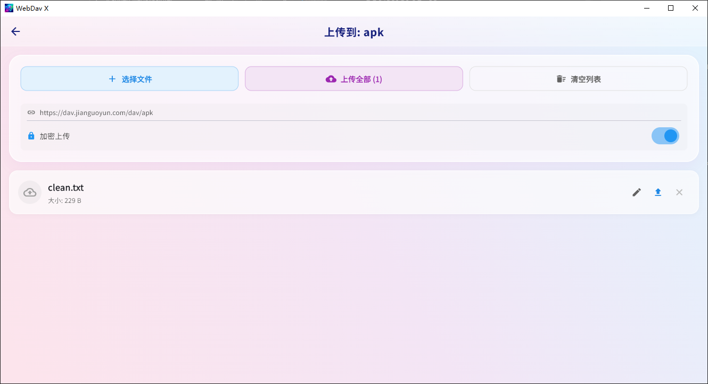
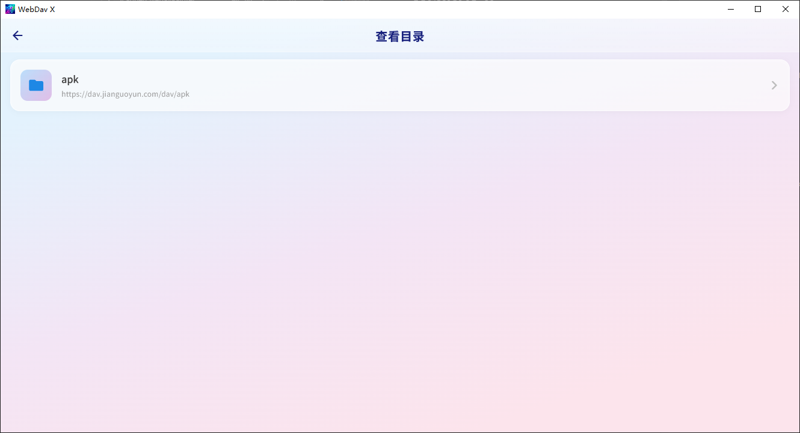
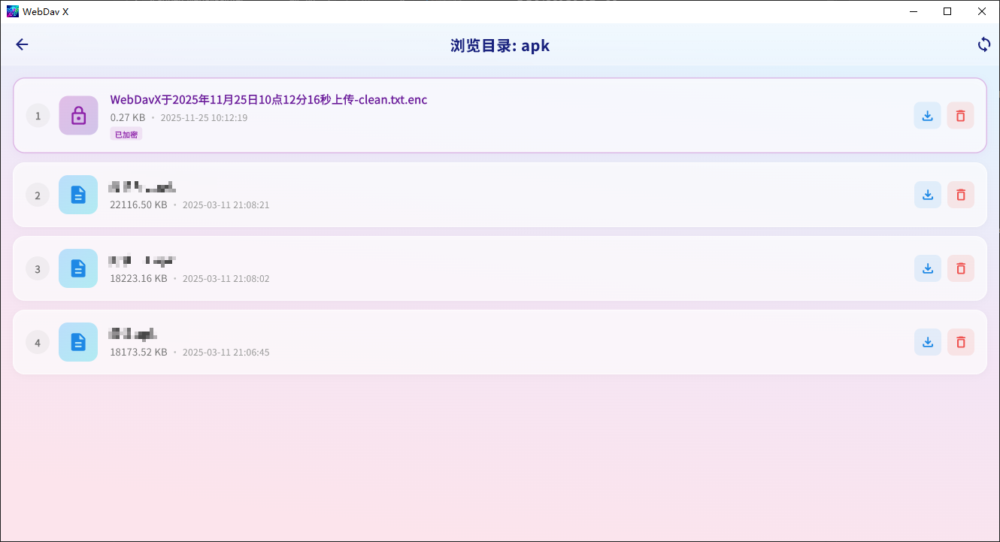

# WebDAV X

支持 Windows、Android 和 iOS，提供便捷的加密文件浏览、上传及管理功能。

因为我的帐密是通过不联网应用管理的，所以我需要备份，但是每次加密备份又很麻烦，所以就有了这个软件。

## 界面

### 主页
| | |
|:---:|:---:|
|  |  |
|  |  |

### 上传
| | |
|:---:|:---:|
|  |  |

### 浏览
| | |
|:---:|:---:|
|  |  |

## 下载注意

### Android
不清楚自己安装哪个就下`android.apk`安装。

### iOS
需要自签或使用`TrollStore`

## 使用
1. 右上角必须先连接 WebDAV 和配置加密密码(必须记住，否则无法解密了)

2. 上传目录
   - 先添加路径，对应坚果云文件夹，没有会自动创建文件夹
   - 点进路径文件夹，可以选择是否加密上传文件

3. 查看目录
   - 查看目录和上传目录的路径是对应的，也就是需要在`上传目录`加路径，这边才会显示

4. 手机可以通过扫描快速引入配置

5. 可以使用本地解密工具去解密文件

6. 如果想删掉应用所有数据，点击`清除所有配置数据`即可

## 运行环境

```
Flutter (.tool-versions)

JDK (17)
```

## 启动

```sh
flutter pub get

flutter run
```
